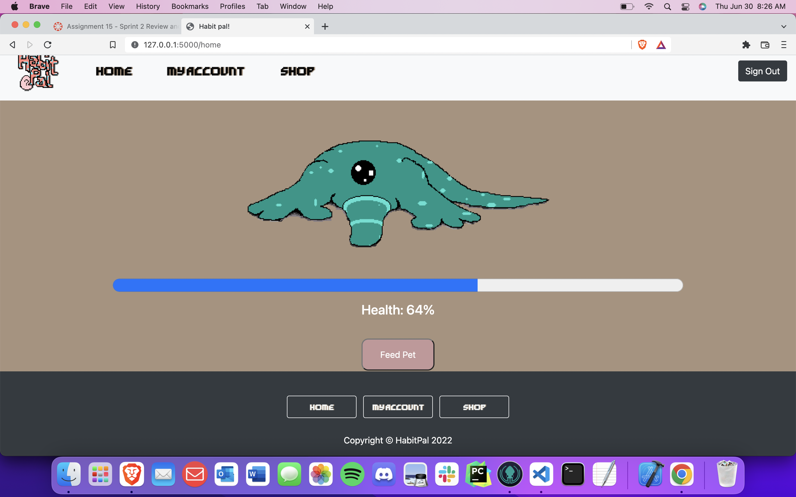
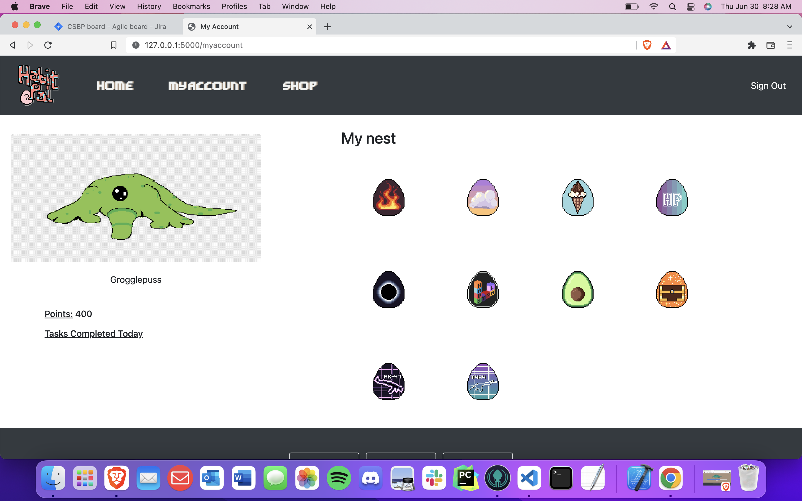

# Project Name

- Habit Pal

Link (https://habitpal.herokuapp.com/)
	
### Team Members:
- Jonathan Andrews
- Lu Bai 
- Ben Prentice
- Irving Donaldson
- Sean Angle

# Description 

### What you're creating?
- A task manager app stylized as a to-do list, where task completion affects a virtual pet's health and happiness.

### Who you’re doing it for, your audience (may be same as the previous question)?
- The audience will be users that document their productivity or organize their daily tasks and errands, such as
	professionals, students, workers, etc. These types of users will also have familiarity/preference for 
	gaming, non-demanding challenges, and fun variations of technology based utilities. 

### Why you’re doing this, the impact or change you hope to make?
- We hope to introduce a small change to time management and bullet lists that can transform them into a more interactive and fun
	experience. This can help impact the user's view of producutivity, and especially help blur the barrier
	between responsibility centered life and enjoyment. 

## Table of Contents
* [General Info](#general-information)
* [Technologies Used](#technologies-used)
* [Features](#features)
* [Screenshots](#screenshots)
* [Setup](#setup)
* [Usage](#usage)
* [Project Status](#project-status)
* [Room for Improvement](#room-for-improvement)
* [Acknowledgements](#acknowledgements)
* [Contact](#contact)
<!-- * [License](#license) -->

## General Information

	
- What do we wish we had to help complete the project?
	- animation capabilities

## Technologies Used
- Tech 1 - Visual Studio Code ( https://code.visualstudio.com/ )
- Tech 2 - Python/Flask ( https://flask.palletsprojects.com/en/2.1.x/ )
- Tech 3 - MySQL ( https://www.mysql.com/ )
- Tech 4 - Javascript ( https://www.javascript.com )
- Tech 5 - Bootstrap ( https://getbootstrap.com )

## Features
List the ready features here:

- Feature 1: Sign Up/ Sign In
	- Sign up and log in.
	- Allow users to make their own account for the website/app.
	- We want our users to be able to save their game progress, also be able to rejoin. And allow users to creat their unique profile.
	
- Feature 2: Task Management System
	- Task list.
	- Allow users to input their daily task they need to finish like a planner. Users will be able to mark their task finished or unfinished themselves.
	- We want to encourage our users to be productive by giving them in game currency if they finish a task.
	
- Feature 3: Avatar Selection 
	- Users Avatar.
	- Users can use in game currency to customize their avatar.
	- We want our user to have their own avatars.

## Screenshots

## Setup
What are the project requirements/dependencies? Where are they listed? A requirements.txt or a Pipfile.lock file perhaps? Where is it located?

Proceed to describe how to install / setup one's local environment / get started with the project.

1. Set up an environment for the website using Anaconda. Instal python 3.9 and flask.
2. Run Anaconda.
3. Command: activate.bat
4. Command: activate <environment_name>
5. Command: cd <project_local_address>
6. Command: flask run
7. ctrl + c to quit.

## Usage
How does one go about using it?
Provide various use cases and code examples here.

`write-your-code-here`

## Project Status
Project is: _in progress_

### Sprint 1:

Lu Bai

- Did reaserch for making websites. (Branch URL: https://bitbucket.org/cs3398-su22-betazoids/cs3398_su22_betazoid_project/branch/feature/CSBP-10-research-html-css-and-javascript-l_b404)

- Setting up environment using Anaconda. Testing and debugging our project. (Branch URL: https://bitbucket.org/cs3398-su22-betazoids/cs3398_su22_betazoid_project/branch/feature/CSBP-20-project-testing-l_b404)

- Fixed css reference (Commit URL: https://bitbucket.org/cs3398-su22-betazoids/cs3398_su22_betazoid_project/commits/8ecf1c303df8ceb4469fb61d4b6742c18391816e)

- Rearrange task list(Commit URL: https://bitbucket.org/cs3398-su22-betazoids/cs3398_su22_betazoid_project/commits/0930e9409c1f05056d4b85cb776abe773b70993a), ect.

- Made icon for the website (Branch URL: https://bitbucket.org/cs3398-su22-betazoids/cs3398_su22_betazoid_project/branch/feature/CSBP-19-create-icon-image-for-app)

- Made avatars for the project (Branch URL: https://bitbucket.org/cs3398-su22-betazoids/cs3398_su22_betazoid_project/branch/feature/CSBP-28-help-creating-finding-avatars-l_b404)

- Next tasks will be keep on testing, debugging, fixing our new codes. Make more avatars and buttons for our project. Help with the pointing(pets health) system.

Jonathan Andrews

- Created HTML, CSS, JS, and background image for login/sigup webpage. https://cs3398su22betazoids.atlassian.net/browse/CSBP-15
- Created several pet avatar pixel art images. https://cs3398su22betazoids.atlassian.net/browse/CSBP-21
- Research done on implementation of Flask and Python. https://cs3398su22betazoids.atlassian.net/browse/CSBP-13
- Testing and Debugging done on finished taks. https://cs3398su22betazoids.atlassian.net/browse/CSBP-22
- Next tasks include final touches on pet avatars, store page development, visual updates for events and a mascot for our project.

Ben Prentice

- Created Python/Flask server https://cs3398su22betazoids.atlassian.net/browse/CSBP-11
- Researched MySQL https://cs3398su22betazoids.atlassian.net/browse/CSBP-14
- Create Database for user login information https://cs3398su22betazoids.atlassian.net/browse/CSBP-16
- Created error page https://cs3398su22betazoids.atlassian.net/browse/CSBP-17
- Fixed bugs https://cs3398su22betazoids.atlassian.net/browse/CSBP-42
             https://cs3398su22betazoids.atlassian.net/browse/CSBP-43
             https://cs3398su22betazoids.atlassian.net/browse/CSBP-44
             https://cs3398su22betazoids.atlassian.net/browse/CSBP-45
- Next Steps: complete login/registration, create database table for avatar states, redirect pages, session setup, connect 404 page, help with avatar animation, connect database to "My Account" page

Irving Donaldson

- Created HTML, CSS, and JS for To Do list on home page. https://bitbucket.org/cs3398-su22-betazoids/cs3398_su22_betazoid_project/branch/feature/CSBP-18-implement-to-do-list

- Added details, formatting, and corrections to To Do list on home page. https://bitbucket.org/cs3398-su22-betazoids/cs3398_su22_betazoid_project/branch/feature/CSBP-41-to-do-list-formatting

- Researched how to do a To Do list with local storage. https://bitbucket.org/cs3398-su22-betazoids/cs3398_su22_betazoid_project/branch/feature/researchToDo

	*This branch may not have a merge, this was a mistake from the learning phase of these tools, but the work is shown and is in the master.

- Researched how to add a counter to the tasks in the To Do list to affect the virtual pet. https://bitbucket.org/cs3398-su22-betazoids/cs3398_su22_betazoid_project/branch/feature/CSBP-37-research-counter-into-listener-f

- Created document of various color palettes for the website that the team would vote on to determine the colors to be implemented in sprint 2. https://bitbucket.org/cs3398-su22-betazoids/cs3398_su22_betazoid_project/branch/feature/CSBP-35-find-color-palette-for-list

- Next Steps: Implenting the color theme into the entirety of the web app, working with Sean to make the To Do List affect the Health Bar, replacing symbols (add button, trash button, etc) with new customized ones, and revising error message conditions.

Sean Angle

- Created the file system and organized pathways to the file. 

- Created the "Home" html page. https://bitbucket.org/cs3398-su22-betazoids/cs3398_su22_betazoid_project/branch/feature/html-landing-page

- Created the Nav Bar for all the pages and linked the pages to the buttons. https://bitbucket.org/cs3398-su22-betazoids/cs3398_su22_betazoid_project/branch/feature/CSBP-34-sla88-build-bootstrap-page

- Created the my account landing page. https://bitbucket.org/cs3398-su22-betazoids/cs3398_su22_betazoid_project/branch/feature/CSBP-39-create-my-account-landing-page

- Next Steps: Work with Irving to implement the health bar and how completing tasks effects the health bar of your pet. I will also create a stats area on the my account page that talks to the back end about how many tasks were completed. 
## Room for Improvement
Include areas you believe need improvement / could be improved. Also add TODOs for future development. 

Room for improvement:
- Presentation of interface
- Combining elements
- To Do List error triggers

To do:
- Implement Coherent color theme
- Bring in pixel pets, integrate with To Do List
- Fix error triggers and test rigorously 

### Sprint 2:

Ben Prentice

- Completed login/registration backend                 https://cs3398su22betazoids.atlassian.net/browse/CSBP-56
- Created database tables for animation states         https://cs3398su22betazoids.atlassian.net/browse/CSBP-57
- Created sessions                                     https://cs3398su22betazoids.atlassian.net/browse/CSBP-59
- Connected custom 404 page                            https://cs3398su22betazoids.atlassian.net/browse/CSBP-60
- Connected Flask to "My Account" page                 https://cs3398su22betazoids.atlassian.net/browse/CSBP-61
- Facilitated avatar "animation" when health changes   https://cs3398su22betazoids.atlassian.net/browse/CSBP-62
- Connected "Sign Out" button to Flask server          https://cs3398su22betazoids.atlassian.net/browse/CSBP-81
- Transferred data from JS, finalized database loading https://cs3398su22betazoids.atlassian.net/browse/CSBP-86
- Fixed bugs       									   https://cs3398su22betazoids.atlassian.net/browse/CSBP-96
- Created ability to add and display points            https://cs3398su22betazoids.atlassian.net/browse/CSBP-99

- Next steps: add sound when achieve full health
              link store to database
			  uncheck to do item will delete item from database
			  fix footer to bottom of content on "Home" page
			  to do list linked to accounts, bypass local memory

Jonathan Andrews

- Complete Avatar Pet Symmetry         				https://cs3398su22betazoids.atlassian.net/browse/CSBP-50
- Complete Coloring for Pet Avatar     				https://cs3398su22betazoids.atlassian.net/browse/CSBP-51
- Create Visual Popups for Egg Purchase     		        https://cs3398su22betazoids.atlassian.net/browse/CSBP-52
- Create Store Landing Page            				https://cs3398su22betazoids.atlassian.net/browse/CSBP-53
- Add Store Asset Images               				https://cs3398su22betazoids.atlassian.net/browse/CSBP-54

- Next steps: Create Visual Popups for pet stage updates such as level up, point rewards, low health, full health. 
	      Create artwork for achievements to be placed on account stats page.

Irving Donaldson

- Implement Color Theme								https://cs3398su22betazoids.atlassian.net/browse/CSBP-71                     
- Health Bar and Task Combining						https://cs3398su22betazoids.atlassian.net/browse/CSBP-72
- Implement New Symbols/ UI							https://cs3398su22betazoids.atlassian.net/browse/CSBP-73
- Create Task Bar									https://cs3398su22betazoids.atlassian.net/browse/CSBP-85
- Implememnt Buttons in Footer						https://cs3398su22betazoids.atlassian.net/browse/CSBP-91
- Fix Padding Bug on Store Header					https://cs3398su22betazoids.atlassian.net/browse/CSBP-93
- Put Logo in Header								https://cs3398su22betazoids.atlassian.net/browse/CSBP-95

- Next steps: Create option for user to choose pet
			  Implement background for pet
			  Make To Do list page more presentable
			  Make Account page more presentable
			  Update Color Palette/ UI

Lu Bai
- Create welcome page                                   https://cs3398su22betazoids.atlassian.net/browse/CSBP-63
- Create/Remake buttons                                 https://cs3398su22betazoids.atlassian.net/browse/CSBP-65
- Create/Remake 404 page                                https://cs3398su22betazoids.atlassian.net/browse/CSBP-79
- Create store items                                    https://cs3398su22betazoids.atlassian.net/browse/CSBP-68
- Create more Store items                               https://cs3398su22betazoids.atlassian.net/browse/CSBP-84
- Test and fix (image fix and login page background)    https://cs3398su22betazoids.atlassian.net/browse/CSBP-92

- Next Steps: Create more items for store (seasonal patch, limited edition items, make changes for feedbacks from users)
			  Login/Sign up page remake
			  UI design for all pages
			  Testing and debugging new codes, as well as study more about back ends and be able to help teammates more
			  
Sean Angle

- Create image location on home page https://cs3398su22betazoids.atlassian.net/browse/CSBP-74
- Add location for image on my account page https://cs3398su22betazoids.atlassian.net/browse/CSBP-77
- Add sign out button on nav bar https://cs3398su22betazoids.atlassian.net/browse/CSBP-78
- Add sign out button for every page https://cs3398su22betazoids.atlassian.net/browse/CSBP-80
- Fix footer overlap on home page and my account page https://cs3398su22betazoids.atlassian.net/browse/CSBP-82

- Next Steps: Create optin for user to choose pet with Irving
			  Implement the three health images for the users pet
			  Finish footer on home page to stay at bottom of the page all the time
			  

## Acknowledgements

## Contact

<!-- Optional -->
<!-- ## License -->
<!-- This project is open source and available under the [... License](). -->

<!-- You don't have to include all sections - just the one's relevant to your project -->
